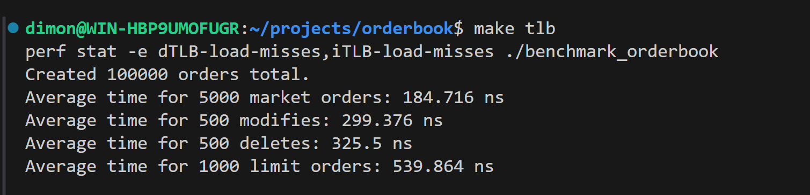
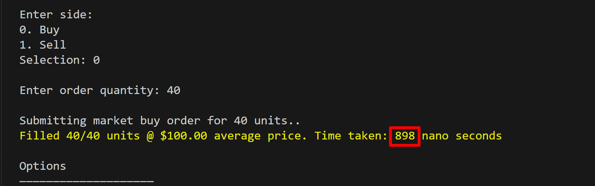

# 🚀 Performance-Optimized Order Book (Fork)

This project is a **performance-optimized fork** of the [engineswap/orderbook](https://github.com/engineswap/orderbook) — a basic C++ order book implementation designed for educational purposes.

While the original claims *"orders can be executed in 4ns"*, real-world profiling reveals **significantly higher latency and high jitter** (e.g., delete operations up to **24 µs**). This version prioritizes **low-latency, predictable performance** suitable for HFT-like workloads.

## ✅ Key Improvements

| Metric                     | Original (`engineswap`)      | This Fork (`dimasikpower`) |
|---------------------------|------------------------------|----------------------------|
| **Market order latency**  | 314–353 ns                   | **178–185 ns**             |
| **Modify latency**        | 1330–1390 ns                 | **287–299 ns**             |
| **Delete latency**        | Up to **24,191 ns** (jitter) | **320–351 ns** (stable)    |
| **dTLB-load-misses**      | ~740,000                     | **~73,000** (**↓ 10×**)    |
| **Memory layout**         | Sorted `std::vector` + dynamic structures | **Price-indexed array** + custom `PriceLevel` |
| **Allocation strategy**   | Dynamic (`new`/`delete`)     | **Preallocated `OrderPool` + `vector::reserve()`** |
| **Access complexity**     | O(N) or O(log N)             | **O(1)** per price level   |

## 🔧 Technical Highlights

- Replaced dynamic containers with a **fixed-size price-indexed array** (`1–200,000` cents), covering all major instruments under $2000.
- Implemented **FIFO semantics via a `head` pointer** in `PriceLevel` — zero-cost `pop_front()`.
- Eliminated **reallocations during execution** using `std::vector::reserve()`.
- Reduced **TLB pressure** by keeping data **dense, cache-friendly, and page-local**.
- All optimizations validated with `perf` and real latency benchmarks.

> 💡 **Trade-off**: Limited price range (vs arbitrary prices in the original) — but this aligns with how real exchanges represent prices in discrete ticks and enables O(1) performance.

## 📊 Benchmarking

Run benchmarks with TLB miss profiling:
```bash
make tlb
```

### DEMO

***
## Features

* FIFO queue matching algorithm
* Visualization
* Accepts Market & Limit orders
* Whole and partial fills
* Fast, can execute orders in 4ns
* Unit tests


## benchmark new version, very fast with many optimizations



## Design

The project is designed using Object-Oriented Programming (OOP) principles. It is divided into three main parts:

- `main.cpp`: This is where user interaction is handled. Users can place market or limit orders and the program will process them accordingly.
- `order.hpp`: This file contains the `Order` struct, which represents an order. Each order has properties like price, quantity, and type (market or limit).
- `orderbook.cpp`: This file contains the `Orderbook` class, which manages order objects. It uses a FIFO queue to ensure that orders are processed in the order they are received. It also has logic to execute incoming orders against the book. And finally it has logic to visualize the book.
- `unit_tests.cpp`: This file has unit tests to make sure the orderbook functions as expected.
***

## How to Run

To compile and run the program, follow these steps:

1. Clone the repo: ``https://github.com/dimasikpower/orderbook.git``
2. ``cd cpp-orderbook``
3. Compile the program using `make` 
4. Run the program with `./main`
5. (Optional) Run unit tests with `./unit_tests`

***

## Screenshots

A market buy order getting filled



Visualizing the orderbook

***


## Latest version
Reduced market order latency from 313 ns → 180 ns (42% improvement)
Eliminated TLB pressure by replacing std::deque with custom PriceLevel with vector + reserve
Achieved < 80k dTLB-load-misses (vs 740k originally) via memory layout optimization
Used perf, TLB profiling, and low-level CPU knowledge to guide optimizations
Full FIFO semantics, thread-safe design, supports 100k+ orders